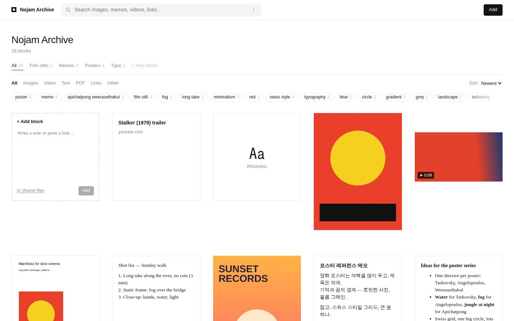
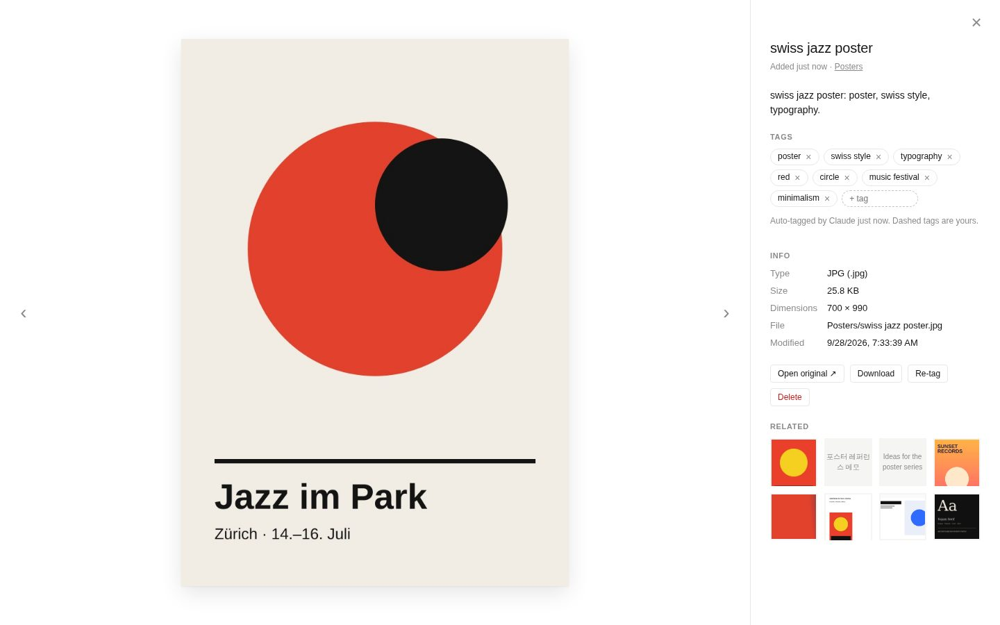
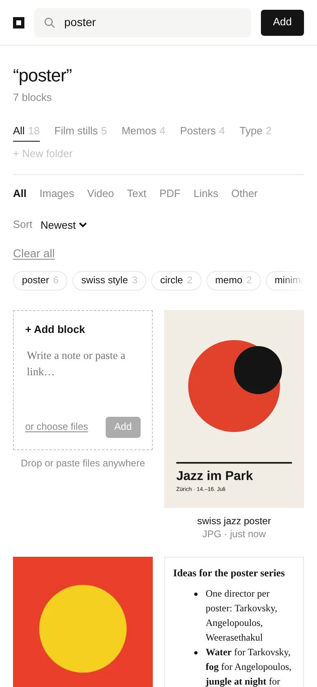

# Nojam Archive

A private, [are.na](https://www.are.na)-style archive for design references: images, memos, videos, PDFs and links.
Everything lives as ordinary files in **one folder in your own cloud drive**, and **Claude tags every new
block for you**, so you can search for “red swiss poster” or “fog long take” without typing tags by hand.



- **Your cloud, your files.** Point it at a folder in iCloud Drive, Google Drive, Dropbox or a NAS share.
  Save something into that folder from your phone and it shows up in the archive a few seconds later, thumbnailed and tagged.
  Nothing is locked in a database: delete the app and your folder is still a normal folder.
- **A calm grid, like are.na.** Thumbnails for every kind of image (HEIC, PSD, TIFF, SVG, RAW, …),
  the first lines of every memo and document (txt, md, rtf, docx, hwp, pdf, …), video frames, link previews and font specimens.
  Sub-folders work like channels.
- **Search that just works.** Type any part of a word, in any language. It looks at file names, the text inside documents,
  and everything Claude wrote about each block. `#tag` filters by an exact tag.
- **Auto-tags by Claude.** For every new block Claude writes a title, 6–12 tags, a one-line summary and hidden search keywords
  (optionally with translations, so English tags can be found in Korean too). You can add or remove tags; your edits always win.

<p align="center"> </p>

---

## Quick start

1. Install **Node.js 22 or newer** from [nodejs.org](https://nodejs.org).
2. In a terminal:
   ```sh
   cd archive
   npm install
   cp .env.example .env
   ```
3. Open `.env` and set two things:
   - `ARCHIVE_DIR`: the folder that holds your references (see [where to keep your files](#where-to-keep-your-files)).
   - `ANTHROPIC_API_KEY`: from [console.anthropic.com](https://console.anthropic.com/) (for auto-tags; everything else works without it).
4. Start it:
   ```sh
   npm start
   ```
   and open **http://localhost:3000**.

The first time, it reads the whole folder and makes thumbnails. If more than 50 blocks are waiting for tags,
it asks before sending them to Claude and shows a rough cost.

Optional, for more previews:
- **ffmpeg** (video thumbnails): a copy is bundled on most computers; if videos show no picture, install it with `brew install ffmpeg` (Mac) or `winget install ffmpeg` (Windows).
- On a **Mac**, the archive also uses the built-in `sips` and Quick Look, which add thumbnails for RAW photos, Keynote, Pages, Sketch, Illustrator and more.

## Where to keep your files

Pick the cloud you already use. The archive only needs the folder to be **on the disk** of the computer running it.

### iCloud Drive (best with an iPhone)

```sh
ARCHIVE_DIR="~/Library/Mobile Documents/com~apple~CloudDocs/Archive"
```

- In Finder, right-click the **Archive** folder in iCloud Drive → **Keep Downloaded**. Otherwise macOS may remove
  local copies to save space, and they have to download again before they can be thumbnailed.
- **From your iPhone:** Share → **Save to Files** → iCloud Drive → Archive. That's it: it appears in the archive with tags.
- If you run the archive in the background (see [keep it running](#keep-it-running-on-a-mac)), give `node` access to
  iCloud Drive in System Settings → Privacy & Security → Full Disk Access (or Files & Folders).

### Google Drive

Install [Google Drive for desktop](https://www.google.com/drive/download/), then:

```sh
# Mac
ARCHIVE_DIR="~/Library/CloudStorage/GoogleDrive-you@gmail.com/My Drive/Archive"
# Windows (use forward slashes)
ARCHIVE_DIR="G:/My Drive/Archive"
```

- Right-click the folder → **Offline access → Available offline** (or set Drive to *Mirror files*).
- **From your phone:** Google Drive app → + → Upload → Archive.

### Your own server or NAS (Docker)

On a Synology/QNAP/Unraid box, a Raspberry Pi or any Linux machine:

```sh
cd archive
cp .env.example .env          # add ANTHROPIC_API_KEY and ARCHIVE_PASSWORD
# edit docker-compose.yml: point the /library volume at your folder
docker compose up -d
```

Keep the folder in sync with your devices using whatever the NAS offers (Synology Drive, Nextcloud, Syncthing,
or Synology Cloud Sync to Google Drive).

> **Two rules for any setup:** keep `DATA_DIR` (the search index and thumbnails, `./data` by default) *outside* the synced
> folder, and run **one** archive server per library folder.

## Open it from your phone, anywhere

The simplest safe way is [Tailscale](https://tailscale.com) (free for personal use): a private network between your own devices.

1. Install Tailscale on the computer running the archive and on your phone, and sign in on both.
2. On the computer: `tailscale serve --bg 3000`
3. Open the `https://<computer-name>.<your-tailnet>.ts.net` address it prints, on your phone. Add it to the home screen.

The archive keeps listening only on the computer itself (`HOST=127.0.0.1`); Tailscale brings it to your devices with HTTPS,
and nobody else can reach it.

Only on your home Wi-Fi instead? Set `HOST=0.0.0.0` **and** `ARCHIVE_PASSWORD=…` in `.env`, then open `http://<computer-ip>:3000`.
Please don't expose the archive to the open internet.

## Keep it running on a Mac

A Mac mini or an old laptop that stays on makes a good archive server. To start it automatically at login, save this as
`~/Library/LaunchAgents/com.nojam.archive.plist` (fix the two paths; `which node` tells you where Node is):

```xml
<?xml version="1.0" encoding="UTF-8"?>
<!DOCTYPE plist PUBLIC "-//Apple//DTD PLIST 1.0//EN" "http://www.apple.com/DTDs/PropertyList-1.0.dtd">
<plist version="1.0">
<dict>
  <key>Label</key><string>com.nojam.archive</string>
  <key>ProgramArguments</key>
  <array>
    <string>/opt/homebrew/bin/node</string>
    <string>--disable-warning=ExperimentalWarning</string>
    <string>server.js</string>
  </array>
  <key>WorkingDirectory</key><string>/Users/you/Nojam-Directors/archive</string>
  <key>RunAtLoad</key><true/>
  <key>KeepAlive</key><true/>
  <key>StandardErrorPath</key><string>/tmp/nojam-archive.log</string>
</dict>
</plist>
```

Then run `launchctl load ~/Library/LaunchAgents/com.nojam.archive.plist`. In System Settings → Energy, allow the Mac
to stay awake when the display is off.

## Using it

- **Add things:** drag files anywhere onto the page, paste (⌘V) a screenshot, an image, a link or some text, or use the
  **+ Add block** square: type a note or paste a link, then ⌘↵. Or just save files into the folder.
- **Links** are saved as small `.url` shortcut files (so they sync too) with a title, description and preview image.
  YouTube and Vimeo play right in the archive. Pasting a link to an image saves the image itself.
- **Memos** are Markdown files. Open one and press **Edit** to change it; Claude re-tags it after you save.
- **Search:** any part of any word, any language. Combine words (`red poster`), use `#tag` for an exact tag,
  and narrow down with folders (channels), the type filter and the tag strip. **Shuffle** is good for rediscovering things.
- **Keyboard:** `/` or ⌘K to search, ← → to move between blocks, Esc to close.
- **Delete** moves the file to a `.trash` folder inside your library, so you can always get it back.

## How auto-tagging works

For each new block, the archive sends Claude:

- a downscaled copy of the picture (at most 1024 px): the image itself, the first page of a PDF, a 4-frame contact
  sheet of a video, the cover of a song, the preview of a design file or the image of a link;
- the file name, folder and, for writings, up to 16,000 characters of text;
- the 150 tags you use most, so it reuses your vocabulary (“poster”, not sometimes “posters” or “poster design”).

Claude answers with a title, tags, a summary and search keywords, as structured JSON. The model is `claude-opus-5` at low effort,
with Claude's server-side refusal fallback (`fallbacks: "default"`) switched on, so a rare policy decline is retried on
another model automatically.

- **Titles:** blocks named like `IMG_2931.jpg` or `Screenshot 2026-…png` show Claude's title instead of the file name.
- **Your edits win:** tags you add are shown with a dashed border; tags you remove stay removed, even after re-tagging.
- **Tags travel with your files:** they're also saved as small JSON files in `<library>/.archive/meta/`, keyed by the
  file's content. They sync with your drive, so a second computer (or a fresh install) gets every tag back without asking Claude
  again. Renaming or moving a file keeps its tags.
- **Cost:** very roughly $0.03 per block with `claude-opus-5`. A big first import asks for your OK first (`TAG_CONFIRM_OVER`).
  If you'd rather spend less, set `CLAUDE_MODEL` to another model, e.g. `claude-sonnet-5` or `claude-haiku-4-5`.
- **Privacy:** only the downscaled picture, the text excerpt and the file name go to Anthropic's API, and only for tagging.
  Set `AUTO_TAG=off` to never send anything.

## What it can show

| Kind | Formats | Block shows |
| --- | --- | --- |
| Images | JPEG, PNG, GIF (animated), WebP, AVIF, SVG, TIFF, BMP, ICO, HEIC/HEIF, PSD/PSB, RAW (DNG, CR2, CR3, NEF, ARW, RAF, ORF, …) | the image |
| Video | MP4, MOV, M4V, WebM play in the browser; MKV, AVI, WMV, … show frames | a frame, with length |
| Audio | MP3, M4A, WAV, FLAC, OGG, … | cover art |
| Writing | TXT, Markdown, RTF, DOCX, ODT, HWP, HWPX, HTML, SRT/VTT subtitles, Fountain, EPUB, PPTX (and DOC on a Mac) | the first lines |
| PDF | PDF and Illustrator `.ai` | the first page, with its text searchable |
| Design | Keynote, Pages, Numbers, Sketch, Figma `.fig`, XD, InDesign, Affinity, EPS | the embedded preview |
| Fonts | TTF, OTF, WOFF, WOFF2 | a live specimen you can type into |
| Links | `.url`, `.webloc`, `.desktop`, Google Drive shortcuts | title, description and preview image |

Anything else still gets a block with its file type, and is found by name. Plain-text files with unusual extensions are detected
and shown as text. Old Korean (CP949) text files are decoded correctly, and Korean file names from a Mac are handled.

## Settings

All settings go in `archive/.env` (see `.env.example`). Real environment variables override the file.

| Setting | Default | |
| --- | --- | --- |
| `ARCHIVE_DIR` | `./library` | The folder with your files. |
| `DATA_DIR` | `./data` | Search index and thumbnails. Keep it out of the synced folder. |
| `ANTHROPIC_API_KEY` | | Turns on auto-tagging. |
| `CLAUDE_MODEL` | `claude-opus-5` | The model used for tagging. |
| `ARCHIVE_LANGUAGES` | `en` | Tag language, then extra languages for hidden search keywords, e.g. `en,ko`. |
| `TAG_CONFIRM_OVER` | `50` | Ask before tagging a backlog larger than this. |
| `TAG_CONCURRENCY` | `2` | Blocks tagged at the same time. |
| `AUTO_TAG` | `on` | `off` to never call Claude. |
| `ARCHIVE_TITLE` | `Archive` | Name shown at the top. |
| `HOST` / `PORT` | `127.0.0.1` / `3000` | Where the web page is served. |
| `ARCHIVE_PASSWORD` | | Asks for a password (any user name) when set. |
| `RESCAN_MINUTES` | `10` | Full rescan interval. The folder is also watched live. |
| `MAX_UPLOAD_MB` | `4096` | Largest upload through the web page. |
| `FFMPEG_PATH` | | Only if ffmpeg isn't found by itself. |

## For developers

```sh
npm test      # extraction, thumbnails, search, tagging (with a stand-in for Claude), API, folder watching
npm run dev   # restarts on code changes
```

- `server.js` starts everything; `src/app.js` is the HTTP API.
- `src/library.js` scans and watches the folder, detects moves and renames, and imports uploads, memos and links.
- `src/analyze.js`, `src/extract.js`, `src/thumbs.js`, `src/media.js`, `src/zip.js`, `src/links.js` turn files into thumbnails, previews and text.
- `src/db.js` is the SQLite index (Node's built-in `node:sqlite`) with a trigram full-text index, so substring search works in every language.
- `src/tagger.js` talks to Claude; `src/sidecar.js` keeps tags next to the files.
- `public/` is the whole web page: plain HTML, CSS and JavaScript, no build step.
